# Agent Baseline Evidence Lab

[](https://github.com/riccardomenegazzo/agent-baseline-evidence-lab/actions/workflows/ci.yml)
[](https://github.com/riccardomenegazzo/agent-baseline-evidence-lab/actions/workflows/customer-trust.yml)
[](https://github.com/riccardomenegazzo/agent-baseline-evidence-lab/releases/latest)
[](pyproject.toml)
[](LICENSE)

**A customer-ready reference PoC that turns AI coding-agent governance into reproducible evidence — from governed Docker execution to a verifiable OCI artifact, agent-to-artifact lineage and signed customer handoff.**

> Community project. Not an official Docker, Snyk, Keycard, or Agent Baseline project. It does **not** issue certifications or claim official conformance.

AI-agent security guidance is easy to describe and much harder to prove. This project asks a narrower question:

> **For this agent, in this environment, during this run: what can we actually prove — and can we link that evidence to the exact software artifact the agent produced?**

It uses the **Agent Baseline v1.0-draft** as a governance vocabulary and **Docker Sandboxes** as the primary execution surface, then extends the evidence chain through Docker Buildx, OCI attestations, optional Docker Scout policy evaluation, agent-to-artifact lineage, a decision brief, SARIF and a privacy-safe signed handoff.

There is deliberately **no marketing security score**.

---

## The Customer Trust Flow

The strongest path in the repository is the end-to-end **Customer Trust Flow**:

```mermaid
flowchart LR
    A[AI coding task] --> B[Docker Sandbox]
    B --> C[Agent-run capsule]
    C --> D[Agent Baseline assessment]
    D --> E[Independent assurance]
    E --> F[Docker Buildx]
    F --> G[OCI + SBOM + provenance]
    G --> H[OCI graph verification]
    H --> I[Optional Docker Scout]
    I --> J[Agent to artifact lineage]
    J --> K[Decision Brief + SARIF]
    K --> L[Signed customer handoff]
```



The project does not treat those boxes as equivalent claims. Each stage has its own evidence source, verifier, trust boundary and failure semantics.

A positive live lineage is produced only when the project verifies that:

1. the selected agent-run evidence manifest is valid;
2. the build context is the workspace recorded by that agent run;
3. the current workspace SHA-256 matches the recorded post-task snapshot;
4. the trusted-artifact stage is `VERIFIED`;
5. the OCI archive digest still matches the trusted-artifact report;
6. the referenced OCI graph verifies recursively;
7. SPDX SBOM evidence exists;
8. SLSA provenance evidence exists;
9. the attestations are subject-bound to the runnable image manifest.

Mutating the workspace after the agent run or altering the OCI archive after verification invalidates the chain. Negative cases are covered by automated tests.

See [`docs/CUSTOMER_TRUST_FLOW.md`](docs/CUSTOMER_TRUST_FLOW.md).

---

## 60-second safe tour

```bash
git clone https://github.com/riccardomenegazzo/agent-baseline-evidence-lab.git
cd agent-baseline-evidence-lab
make install
make customer-trust-dry-run
```

The dry-run target generates a local demo Ed25519 keypair only when one does not already exist, then exercises the complete orchestration contract without mutating Docker state.

Dry-run is intentionally fail-closed. It cannot claim live containment, runtime enforcement, a real OCI build, live SBOM/provenance generation, Docker Scout enforcement or positive agent-to-artifact lineage.

The dedicated `customer-trust` GitHub Actions workflow continuously tests that contract and independently re-verifies the generated handoff.

For a non-technical summary start with [`docs/EXECUTIVE_OVERVIEW.md`](docs/EXECUTIVE_OVERVIEW.md). For the meeting walkthrough use [`docs/DEMO_GUIDE.md`](docs/DEMO_GUIDE.md).

---

## Why this exists

An enterprise adopting coding agents needs stronger answers than:

- “the agent runs in a sandbox”;
- “we have an MCP policy”;
- “audit logs exist”;
- “the stop command succeeded”;
- “the image has an SBOM”;
- “provenance exists”;
- “Scout passed”;
- “the artifact is signed”.

Those statements describe product presence, intent or isolated signals. They do not necessarily prove isolation, enforcement, attribution, containment, source completeness, artifact integrity, attestation subject binding, lineage or trusted signer identity.

The design goal is simple:

> **Prove what can be proven, preserve the evidence, and make everything else visible.**

---

## What the project demonstrates

A customer PoC can use this repository to:

1. **Run a real coding task** inside a uniquely identified Docker Sandbox.
2. **Observe selected execution boundaries** through Docker `sbx` inventory, filesystem canaries and network-policy decisions.
3. **Assess all 35 draft Agent Baseline controls** without converting missing evidence into `PASS`.
4. **Analyze MCP governance posture** through Cedar-policy checks and optional Docker AI Governance audit metadata.
5. **Validate the agent-modified workspace**, not a separate static fixture.
6. **Preserve assessment evidence integrity** with per-file SHA-256 manifests and a hash-chained normalized trace.
7. **Authenticate selected evidence artifacts** with Ed25519 signatures.
8. **Exercise response semantics** with verified postconditions and explicit provider-revocation boundaries.
9. **Build the exact agent workspace with Docker Buildx** using SBOM and provenance attestations.
10. **Independently verify the OCI graph**, descriptors, config, layers and attestation manifests.
11. **Verify SPDX SBOM + SLSA provenance subject binding** instead of trusting artifact names.
12. **Evaluate Docker Scout policy** in explicit `off`, `observe` or fail-closed `gate` mode.
13. **Create agent → workspace → OCI artifact lineage** and invalidate it on later mutation.
14. **Generate an evidence-derived Customer Decision Brief** with no synthetic score.
15. **Export findings as SARIF 2.1.0** for standard security-tool ingestion.
16. **Create a privacy-safe signed Customer Trust Handoff** with nested verification and no private key or OCI binary archive.
17. **Compare two verified runs** through Governance Delta.
18. **Fail closed on causal interpretation** when a before/after pair is insufficiently controlled.

---

## Evidence semantics

### Agent Baseline control statuses

`PASS` · `FAIL` · `PARTIAL` · `MANUAL` · `N/A` · `ERROR`

A skipped live probe is never counted as a pass.

### Evidence classes

| Class | Meaning |
|---|---|
| **Declared** | configuration and design intent |
| **Observed** | runtime state, policy decisions and postconditions actually collected |
| **Linked** | artifacts correlated by stable identifiers or cryptographic digests |
| **Externally anchored** | evidence authenticated against trust material outside the artifact being verified |

### Customer decision statuses

| Decision | Meaning |
|---|---|
| `BLOCKED` | a blocking check failed or required evidence is missing |
| `CONDITIONAL` | useful evidence exists, but material gaps/findings remain |
| `EVIDENCE_READY` | evidence required by the selected PoC mode was observed and verified |
| `DRY_RUN` | orchestration was validated without live trust claims |

`EVIDENCE_READY` means **ready for the next human/organizational decision**. It does not mean production approved, certified or vulnerability-free.

---

## Live Customer Trust Flow

A live run requires a suitable Docker environment and the relevant Docker Sandboxes authentication/configuration.

Prepare the signed baseline and local signing identity:

```bash
make baseline-sync
make signing-keygen
make baseline-lock-verify
make baseline-lock-sign
make baseline-lock-verify-signature
```

### Observe mode — recommended first PoC

```bash
make customer-trust SCOUT_MODE=observe
```

or, after installation:

```bash
abl-trust --scout-mode observe
```

Scout findings remain visible evidence but do not independently hard-block the decision.

### Gate mode

```bash
make customer-trust SCOUT_MODE=gate
```

or:

```bash
abl-trust --scout-mode gate
```

A non-passing Scout result prevents `EVIDENCE_READY` in gate mode.

### MCP-focused mode

```bash
make customer-trust-mcp SCOUT_MODE=observe
```

or:

```bash
abl-trust --profile mcp --scout-mode observe
```

Docker AI Governance audit evidence remains optional and is promoted to observed evidence only when finalized records are actually available.

---

## Trusted software-supply-chain evidence

The trusted-artifact stage builds the exact post-agent workspace and requests:

```text
--sbom=true
--provenance=mode=max
--output type=oci
```

The verifier does **not** accept “files with convincing names” as proof. It inspects the OCI representation itself.

It checks, among other things:

- top-level OCI descriptor digest and size;
- runnable image manifest integrity;
- attestation manifest integrity;
- referenced config blobs;
- referenced binary layers using streaming SHA-256;
- unsafe/duplicate archive member ambiguity;
- in-toto statement type;
- SPDX predicate presence;
- SLSA provenance predicate presence;
- attestation subject binding to the runnable image manifest.

The Dockerfile contract separately records final non-root posture, external base-image references, digest-pinning/reproducibility posture and runtime `HEALTHCHECK` declaration.

Docker Scout is an additional policy signal, not a substitute for the independent OCI verifier.

---

## Signed Customer Trust Handoff

The final handoff can contain:

```text
customer-trust-handoff.zip
├── handoff-manifest.json
├── governance/
│   └── golden-flow.json
├── evidence/
│   ├── customer-evidence-pack.zip
│   └── customer-evidence-pack.zip.ed25519.json
├── trust/
│   └── attestation-public.json
├── supply-chain/
│   ├── trusted-artifact.json
│   ├── trusted-artifact.ed25519.json
│   └── optional Scout / BuildKit evidence
├── lineage/
│   ├── agent-artifact-lineage.json
│   └── agent-artifact-lineage.ed25519.json
├── decision/
│   ├── customer-decision.json
│   ├── customer-decision.html
│   └── customer-decision.ed25519.json
├── integrations/
│   └── agent-governance.sarif
└── customer-trust-flow.html
```

The handoff verifier checks its manifest/digests, nested customer evidence pack, nested signatures, safe archive paths, private-key exclusion and lineage signature where present.

Verify the latest handoff:

```bash
make trust-handoff-verify
```

or a specific one:

```bash
make trust-handoff-verify HANDOFF=reports/<run-id>.customer-trust-handoff.zip
```

The default customer handoff explicitly excludes:

- private signing keys;
- raw agent prompt/stdout/stderr;
- host filesystem paths;
- Docker credentials/local Docker state;
- OCI binary image archive and layers;
- unrelated local `.abl` state.

The final ZIP is itself signed.

---

## Optional Docker MCP / AI Governance path

Register Docker's public DHI MCP endpoint:

```bash
make mcp-register-dhi
```

Observe registration and OAuth metadata without persisting token material:

```bash
make mcp-inventory-dhi
make mcp-oauth-status
```

With a live sandbox, probe direct-network bypass posture:

```bash
make mcp-bypass-dhi SANDBOX=<sandbox-name>
```

Static policy analysis remains **policy evidence**, not proof of runtime enforcement.

---

## Independent assessment verification

After an assessment:

```bash
make verify
make assurance-latest
```

`abl verify` checks that:

1. every manifested evidence file still matches its SHA-256 digest;
2. each normalized trace event links to the previous event hash;
3. final trace hash and event count match the assessment anchors.

The assurance suite adds integrity/authenticity regression checks, signature verification, drift signals and response/incident evidence when available.

---

## Before / after governance evidence

### Governance Delta — what changed?

```bash
make governance-delta \
  BEFORE=evidence/abl-<before> \
  AFTER=evidence/abl-<after>
```

The delta classifies control improvement/regression, evidence gain/loss, evaluator recovery/error, scope change and unchanged controls. It does **not** compute a security score.

### Controlled Experiment Protocol — can we discuss causality?

```bash
make experiment-protocol \
  BEFORE=evidence/abl-<before> \
  AFTER=evidence/abl-<after>
```

It returns:

- `ELIGIBLE` — required measured invariants match and treatment differs;
- `NOT_ELIGIBLE` — an invariant differs or no treatment change occurred;
- `INSUFFICIENT_EVIDENCE` — a required invariant cannot be established.

`ELIGIBLE` is not proof of causality.

---

## What gets produced

```text
agent-runs/
└── agent-<timestamp>-<id>/
    ├── session.json
    ├── workspace-before.json
    ├── workspace-after.json
    ├── workspace-changes.json
    ├── docker-observations.json
    └── manifest.sha256.json

evidence/
└── abl-<timestamp>/
    ├── controls/
    ├── observations/
    ├── trace/events.ndjson
    ├── assessment.json
    └── manifest.sha256.json

reports/
├── abl-<timestamp>.json
├── abl-<timestamp>.html
├── abl-<timestamp>.attestation.json
├── assurance-summary.json
├── abl-<timestamp>.trust/
│   ├── trusted-artifact/
│   ├── trusted-artifact.portable.json
│   ├── agent-artifact-lineage.json
│   ├── customer-decision.portable.json
│   ├── customer-decision.portable.html
│   ├── agent-governance.sarif
│   └── customer-trust-flow.html
├── abl-<timestamp>.customer-trust-handoff.zip
├── governance-delta.json
├── controlled-experiment.json
└── governance-comparison-pack.zip
```

Raw prompts and raw agent output are not persisted by default.

---

## Claims the project deliberately refuses

The lab does **not** assume that:

```text
Docker Sandbox installed  -> isolation fully solved
MCP Gateway present       -> authorization solved
policy file exists        -> enforcement proven
SBOM exists               -> artifact secure
provenance exists         -> code correct
Scout passes              -> vulnerability-free / certified
lineage verifies          -> workload safe
signature verifies        -> signer identity trusted
hash chain verifies       -> source telemetry complete
before/after improves     -> treatment caused improvement
```

See [`docs/CLAIMS_BOUNDARY.md`](docs/CLAIMS_BOUNDARY.md).

---

## Download and verify a release

The recommended distribution channel is [GitHub Releases](https://github.com/riccardomenegazzo/agent-baseline-evidence-lab/releases/latest).

Automated releases publish:

- Python wheel;
- source distribution;
- `SHA256SUMS`;
- `release-manifest.json` binding artifact digests to the source commit.

The release workflow also creates **GitHub Artifact Attestations with SLSA provenance** for those downloadable artifacts and verifies the attestations before publication.

Checksum verification and provenance verification are intentionally separate:

```bash
sha256sum -c SHA256SUMS

gh attestation verify <artifact> \
  --repo riccardomenegazzo/agent-baseline-evidence-lab
```

See [`DOWNLOAD.md`](DOWNLOAD.md) and [`docs/RELEASE_PROVENANCE.md`](docs/RELEASE_PROVENANCE.md).

---

## Documentation map

- **Executive / recruiting / leadership:** [`docs/EXECUTIVE_OVERVIEW.md`](docs/EXECUTIVE_OVERVIEW.md)
- **End-to-end customer trust chain:** [`docs/CUSTOMER_TRUST_FLOW.md`](docs/CUSTOMER_TRUST_FLOW.md)
- **Customer PoC:** [`docs/CUSTOMER_POC.md`](docs/CUSTOMER_POC.md)
- **Demo walkthrough:** [`docs/DEMO_GUIDE.md`](docs/DEMO_GUIDE.md)
- **Architecture:** [`docs/ARCHITECTURE.md`](docs/ARCHITECTURE.md)
- **Control coverage:** [`docs/CONTROL_COVERAGE.md`](docs/CONTROL_COVERAGE.md)
- **Evidence model:** [`docs/EVIDENCE_MODEL.md`](docs/EVIDENCE_MODEL.md)
- **Docker evidence sources:** [`docs/DOCKER_EVIDENCE_SOURCES.md`](docs/DOCKER_EVIDENCE_SOURCES.md)
- **Governance Delta:** [`docs/GOVERNANCE_DELTA.md`](docs/GOVERNANCE_DELTA.md)
- **Controlled Experiment Protocol:** [`docs/CONTROLLED_EXPERIMENT.md`](docs/CONTROLLED_EXPERIMENT.md)
- **Response evidence:** [`docs/RESPONSE_DRILL.md`](docs/RESPONSE_DRILL.md)
- **Claims boundary:** [`docs/CLAIMS_BOUNDARY.md`](docs/CLAIMS_BOUNDARY.md)
- **Release provenance:** [`docs/RELEASE_PROVENANCE.md`](docs/RELEASE_PROVENANCE.md)
- **Roadmap:** [`docs/ROADMAP.md`](docs/ROADMAP.md)

---

## Development and CI

```bash
make install
make test
make lint
make customer-trust-dry-run
abl-trust --help
```

Two independent GitHub Actions workflows protect the main behavior:

- `ci` exercises package build, installed CLI entrypoints, framework tests, sample-app tests, offline assessment, evidence verification, adversarial verifier regression, response semantics, signing, Governance Delta, comparison handoff, privacy boundaries, assurance and Golden Flow;
- `customer-trust` exercises the complete fail-closed Customer Trust Flow, independently verifies its signed handoff and asserts that dry-run cannot manufacture live lineage/trust claims.

The release workflow publishes only after the main CI succeeds. It builds and smoke-tests distribution artifacts, creates checksums + source-bound metadata, generates SLSA provenance attestations, verifies those attestations, and only then publishes an immutable GitHub Release.

---

## Project status

The repository is an **implementation, assurance and customer-PoC lab**, not a finished enterprise governance product.

The current main branch includes:

- all 35 Agent Baseline draft controls with explicit evidence semantics;
- Docker Sandbox runtime probes and bounded adversarial scenarios;
- MCP policy analysis and optional Docker AI Governance audit ingestion;
- privacy-minimized evidence and trace generation;
- run attestations and Ed25519 signing;
- response, quarantine and incident evidence;
- portable customer evidence packs;
- Governance Delta and Controlled Experiment Protocol;
- Docker Buildx SBOM/provenance trusted-artifact path;
- recursive OCI graph integrity verification;
- Docker Scout `off / observe / gate` integration;
- agent → artifact lineage;
- Customer Decision Brief;
- SARIF export;
- signed privacy-safe Customer Trust Handoff;
- dedicated end-to-end trust CI workflow;
- release checksums plus GitHub/Sigstore-backed SLSA provenance.

Remaining work is intentionally focused on stronger **live enterprise evidence**, external identity/trust anchors and reusable customer policy profiles — not on manufacturing green results for unavailable signals.

See [`docs/ROADMAP.md`](docs/ROADMAP.md).

---

## License

Apache-2.0 for this repository's code. Agent Baseline materials remain under their upstream licenses and ownership; authoritative control requirement prose is not silently vendored here.
