# Agent Baseline Evidence Lab

[](https://github.com/riccardomenegazzo/agent-baseline-evidence-lab/actions/workflows/ci.yml)
[](https://github.com/riccardomenegazzo/agent-baseline-evidence-lab/actions/workflows/customer-trust.yml)
[](https://github.com/riccardomenegazzo/agent-baseline-evidence-lab/releases/latest)
[](pyproject.toml)
[](LICENSE)

**A customer-ready reference PoC for turning AI coding-agent governance into reproducible, independently verifiable evidence — from Docker Sandbox execution to OCI supply-chain evidence, agent-to-artifact lineage, customer-specific acceptance, verified artifact change analysis and signed remediation transition handoff.**

> Community project. Not an official Docker, Snyk, Keycard or Agent Baseline project. It does **not** issue certifications or claim official conformance.

## The problem

Enterprise conversations about coding agents often stop at statements such as:

- “the agent runs in a sandbox”;
- “MCP is governed”;
- “we have audit logs”;
- “the image has an SBOM”;
- “provenance exists”;
- “Scout passed”.

Those are useful signals, but they are not automatically proof of isolation, enforcement, attribution, artifact integrity, attestation binding or customer acceptance.

This project asks a narrower question:

> **For this agent, in this environment, during this run: what can we actually prove, what changed, and can another party verify the same conclusion offline?**

There is deliberately **no synthetic trust/security score**.

---

## Customer Trust Flow

```mermaid
flowchart LR
    A[AI coding task] --> B[Docker Sandbox]
    B --> C[Agent-run capsule]
    C --> D[Agent Baseline assessment]
    D --> E[Independent assurance]
    E --> F[Docker Buildx]
    F --> G[OCI + SBOM + provenance]
    G --> H[OCI graph verification]
    H --> I[Optional Docker Scout]
    I --> J[Agent to artifact lineage]
    J --> K[Customer Decision Brief]
    K --> L[Signed Customer Trust Handoff]
    L --> M[Versioned customer policy]
    M --> N[Signed Customer Acceptance Envelope]
    N --> O[Verified before/after artifact diff]
    O --> P[Signed remediation transition handoff]
```



Every stage has its own evidence source, verifier, trust boundary and failure semantics. A skipped live probe is never converted into a pass.

See [Customer Trust Flow](docs/CUSTOMER_TRUST_FLOW.md).

---

## v0.16: verified remediation transition pack

A before/after customer engagement normally has at least two different questions:

- **Did the governance evidence improve?**
- **What actually changed in the OCI artifact?**

`abl-transition` packages both answers into one signed handoff while keeping their semantics separate.

```text
before/after evidence ----> signed Governance Comparison Pack --+
                                                               +--> signed Transition Pack
before/after OCI trust ---> signed OCI Artifact Diff ----------+
```

The transition pack embeds the existing governance comparison, the signed artifact diff and the exact trusted-artifact reports used to generate that diff. It deliberately does **not** duplicate the potentially large OCI archives.

A recipient gets two verification levels:

- **portable verification** — deterministic member hashes, signatures, public-key continuity and source-report binding;
- **full OCI recomputation** — when the original OCI archives are available, the verifier replays graph integrity, SBOM/provenance subject binding and the complete artifact diff.

Governance change and artifact change are never treated as causal evidence for one another.

See [Verified Remediation Transition Pack](docs/REMEDIATION_TRANSITION_PACK.md).

---

## v0.15: verified OCI artifact diff

A digest changing does not tell a customer **what** changed. Worse, two OCI tar archives can have different bytes because of tar ordering or metadata while representing the same verified runnable graph.

`abl-artifact-diff` separates:

1. **archive byte identity**;
2. **runnable OCI graph identity** — platform, manifest, config and ordered layers;
3. **selected supply-chain evidence identity** — predicate types, normalized SLSA materials and subject-binding facts.

```text
trusted artifact A ----verify----+
                                 +--> canonical OCI diff --> verify again
trusted artifact B ----verify----+
```

The result is one of:

| Classification | Meaning |
|---|---|
| `IDENTICAL` | Archive bytes and modeled identities are unchanged. |
| `REPACKAGED_EQUIVALENT` | Archive bytes differ while modeled runnable graph and selected build evidence remain stable. |
| `BUILD_EVIDENCE_CHANGED` | Runnable graph is stable while provenance/base-image/Scout evidence changes. |
| `ARTIFACT_CHANGED` | Runnable manifest/config/layer graph changed. |

It also emits explicit added/removed manifests, configs, layers, predicate types, attestation statements, provenance materials and declared base-image references.

If the same SLSA material URI resolves to a different digest, that transition is surfaced directly instead of being hidden inside an opaque attestation digest.

See [Verified OCI Artifact Diff](docs/OCI_ARTIFACT_DIFF.md).

---

## v0.14: customer-specific acceptance without rewriting evidence

The same signed Customer Trust Handoff can be evaluated against different customer requirements:

```text
                    +--> Customer A policy --> acceptance A
verified handoff ---+
                    +--> Customer B policy --> acceptance B
```

A policy can reject evidence. It cannot turn missing evidence into `PASS`.

The wheel ships three example profiles:

- `builtin:poc-observe`
- `builtin:enterprise-strict`
- `builtin:enterprise-supply-chain`

The artifact-aware profile can require non-root posture, runtime `HEALTHCHECK`, OCI attestation integrity, SPDX SBOM, SLSA provenance and valid subject bindings from the actual trusted artifact carried by the signed handoff.

See [Customer Policy Profiles](docs/CUSTOMER_POLICY_PROFILES.md).

---

## 60-second safe tour

```bash
git clone https://github.com/riccardomenegazzo/agent-baseline-evidence-lab.git
cd agent-baseline-evidence-lab
make install
make customer-trust-dry-run
```

Dry-run exercises orchestration without mutating Docker state. It intentionally cannot claim live containment, a real OCI build, live SBOM/provenance generation, Docker Scout enforcement or positive agent-to-artifact lineage.

For the shortest non-technical overview, read [Executive Overview](docs/EXECUTIVE_OVERVIEW.md). For a meeting walkthrough, use [Demo Guide](docs/DEMO_GUIDE.md).

---

## Core capabilities

The repository currently implements:

1. **35 Agent Baseline draft controls** with explicit evidence statuses.
2. **Docker Sandbox execution evidence** with run-scoped workspaces.
3. **MCP governance analysis** with inventory, Cedar analysis, audit correlation and bypass probes.
4. **Tamper-evident assessment evidence** using SHA-256 manifests and a hash-chained trace.
5. **Independent post-run assurance** with adversarial verifier tests.
6. **Response and incident evidence** with postconditions, quarantine and incident bundles.
7. **Docker Buildx trusted-artifact flow** with OCI output, SBOM and provenance.
8. **Independent OCI verification** of descriptors, config, layers and in-toto attestations.
9. **Docker Scout integration** with `off`, `observe` and fail-closed `gate` modes.
10. **Agent → workspace → OCI artifact lineage** invalidated by later mutation.
11. **Customer Decision Brief** with `BLOCKED / CONDITIONAL / EVIDENCE_READY / DRY_RUN`.
12. **SARIF 2.1.0 export**.
13. **Signed Customer Trust Handoff** with privacy controls and offline verification.
14. **Governance Delta** for before/after evidence transitions.
15. **Controlled Experiment Protocol** that refuses causal language when invariants are insufficient.
16. **Versioned customer policy profiles** with canonical policy digests.
17. **Artifact-aware customer acceptance** against nested trusted-artifact evidence.
18. **Signed Customer Acceptance Envelope** with offline recomputation.
19. **Verified OCI Artifact Diff** distinguishing archive bytes, runnable graph and supply-chain evidence.
20. **Verified Remediation Transition Pack** joining governance and artifact transitions without conflating them.
21. **Release supply-chain dogfooding** with checksums and GitHub/Sigstore-backed SLSA provenance.

---

## Evidence semantics

### Assessment statuses

`PASS` · `FAIL` · `PARTIAL` · `MANUAL` · `N/A` · `ERROR`

### Evidence classes

| Class | Meaning |
|---|---|
| **Declared** | configuration/design intent |
| **Observed** | runtime state, decisions and postconditions actually collected |
| **Linked** | evidence correlated by stable identifiers or cryptographic digests |
| **Externally anchored** | evidence authenticated against trust material outside the artifact being verified |

`EVIDENCE_READY` means ready for the next human/organizational decision — not production approved, certified or vulnerability-free.

---

## Trusted software-supply-chain evidence

The trusted-artifact stage builds the exact post-agent workspace with Docker Buildx and requests:

```text
--sbom=true
--provenance=mode=max
--output type=oci
```

The verifier checks the OCI representation itself, including descriptor digest/size, runnable manifest/config/layers, attestation manifests, in-toto statement types, SPDX presence, SLSA provenance presence and subject binding.

Docker Scout is a separate policy signal, not a substitute for OCI verification.

---

## Run a live Customer Trust Flow

Prepare baseline/signing material:

```bash
make baseline-sync
make signing-keygen
make baseline-lock-verify
make baseline-lock-sign
make baseline-lock-verify-signature
```

Then:

```bash
make customer-trust SCOUT_MODE=observe
# or
make customer-trust SCOUT_MODE=gate
```

Live evidence remains dependent on the installed Docker/Sandboxes/MCP environment. Unavailable evidence is not silently synthesized.

---

## Create a remediation transition handoff

```bash
abl-transition create \
  evidence/abl-before \
  evidence/abl-after \
  reports/before-trusted-artifact.json \
  reports/after-trusted-artifact.json \
  --output reports/remediation-transition.zip
```

Portable verification:

```bash
abl-transition verify \
  reports/remediation-transition.zip \
  --signature reports/remediation-transition.zip.ed25519.json \
  --public .abl/keys/attestation-public.json
```

Add `--before-trusted-artifact`, `--after-trusted-artifact` and `--root` when the original OCI archives are locally available and full artifact-diff recomputation is required.

See [Verified Remediation Transition Pack](docs/REMEDIATION_TRANSITION_PACK.md).

---

## Compare two verified OCI artifacts

```bash
abl-artifact-diff create \
  reports/before/trusted-artifact.json \
  reports/after/trusted-artifact.json \
  --output reports/oci-artifact-diff.json \
  --html reports/oci-artifact-diff.html
```

Verify:

```bash
abl-artifact-diff verify \
  reports/oci-artifact-diff.json \
  reports/before/trusted-artifact.json \
  reports/after/trusted-artifact.json
```

The command re-verifies both OCI archives before computing the diff. It does not infer causality from the observed transition.

---

## Evaluate customer acceptance

```bash
abl-policy evaluate \
  builtin:enterprise-supply-chain \
  reports/customer-decision.json \
  --trusted-artifact reports/trusted-artifact.json \
  --output reports/customer-policy-evaluation.json
```

A signed Customer Acceptance Envelope can then bind the verified handoff, decision, trusted artifact, exact policy and recomputed evaluation.

See [Customer Policy Profiles](docs/CUSTOMER_POLICY_PROFILES.md).

---

## Claims deliberately refused

```text
Docker Sandbox installed  -> isolation fully solved
MCP Gateway present       -> authorization solved
policy file exists        -> runtime enforcement proven
SBOM exists               -> artifact secure
provenance exists         -> code correct
Scout passes              -> vulnerability-free / certified
lineage verifies          -> workload safe
signature verifies        -> signer identity trusted
hash chain verifies       -> source telemetry complete
policy passes             -> production authorized
artifact diff observed    -> cause of change proven
transition pack verifies  -> remediation caused improvement
before/after improves     -> treatment caused improvement
```

See [Claims Boundary](docs/CLAIMS_BOUNDARY.md).

---

## Download and verify a release

Use [GitHub Releases](https://github.com/riccardomenegazzo/agent-baseline-evidence-lab/releases/latest).

Releases publish wheel, source distribution, `SHA256SUMS`, source-bound `release-manifest.json` and GitHub Artifact Attestations with SLSA provenance.

```bash
sha256sum -c SHA256SUMS

gh attestation verify <artifact> \
  --repo riccardomenegazzo/agent-baseline-evidence-lab
```

See [Download](DOWNLOAD.md) and [Release Provenance](docs/RELEASE_PROVENANCE.md).

---

## Documentation

- [Executive Overview](docs/EXECUTIVE_OVERVIEW.md)
- [Customer Trust Flow](docs/CUSTOMER_TRUST_FLOW.md)
- [Verified Remediation Transition Pack](docs/REMEDIATION_TRANSITION_PACK.md)
- [Verified OCI Artifact Diff](docs/OCI_ARTIFACT_DIFF.md)
- [Customer Policy Profiles](docs/CUSTOMER_POLICY_PROFILES.md)
- [Customer PoC](docs/CUSTOMER_POC.md)
- [Demo Guide](docs/DEMO_GUIDE.md)
- [Architecture](docs/ARCHITECTURE.md)
- [Control Coverage](docs/CONTROL_COVERAGE.md)
- [Evidence Model](docs/EVIDENCE_MODEL.md)
- [Docker Evidence Sources](docs/DOCKER_EVIDENCE_SOURCES.md)
- [Governance Delta](docs/GOVERNANCE_DELTA.md)
- [Controlled Experiment Protocol](docs/CONTROLLED_EXPERIMENT.md)
- [Response Evidence](docs/RESPONSE_DRILL.md)
- [Claims Boundary](docs/CLAIMS_BOUNDARY.md)
- [Release Provenance](docs/RELEASE_PROVENANCE.md)
- [Roadmap](docs/ROADMAP.md)

---

## Development

```bash
make install
make test
make lint
make customer-trust-dry-run
abl-policy list-profiles
abl-accept --help
abl-artifact-diff --help
abl-transition --help
```

The project is an **implementation, assurance and customer-PoC lab**, not a finished enterprise governance product. Remaining work is intentionally concentrated on real Docker AI Governance evidence, stronger external signer identity/trust anchors, provider-side revocation postconditions and sanitized live reference fixtures — not superficial green checks.

## License

Apache-2.0 for this repository's code. Agent Baseline materials remain under their upstream licenses and ownership; authoritative control requirement prose is not silently vendored here.
