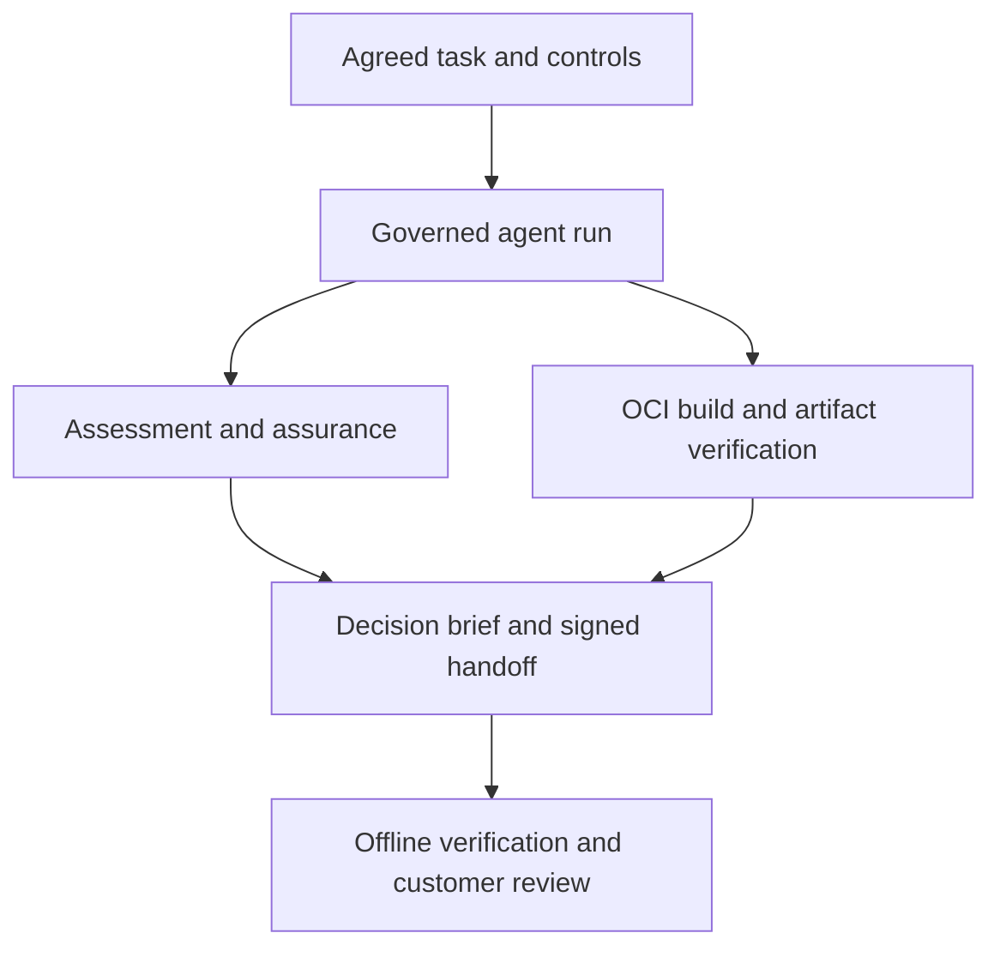

# Agent Baseline Evidence Lab

[](https://github.com/riccardomenegazzo/agent-baseline-evidence-lab/actions/workflows/ci.yml)
[](https://github.com/riccardomenegazzo/agent-baseline-evidence-lab/actions/workflows/customer-trust.yml)
[](https://github.com/riccardomenegazzo/agent-baseline-evidence-lab/releases/latest)
[](pyproject.toml)
[](LICENSE)

**Turn a customer’s AI coding-agent governance questions into run-specific evidence, a clear decision brief and a signed handoff another reviewer can verify offline.**

A customer asks: “Can our coding agent complete a useful task within our agreed controls, and what evidence can we give the security team?” This lab follows a small coding task from its governed workspace to a container artifact, records the observed controls and makes the remaining evidence gaps explicit.

> Community reference PoC, currently alpha. Not an official Docker or Agent Baseline project. It does not issue certifications, authorize production use or guarantee security.

## Try it without a live agent

Requires **Python 3.11+**. On macOS, check `python3 --version` first and use a supported Python installation. Run these commands from the cloned repository:

```bash
git clone https://github.com/riccardomenegazzo/agent-baseline-evidence-lab.git
cd agent-baseline-evidence-lab
make install
source .venv/bin/activate
make customer-trust-dry-run
abl-present --open
```

Installation downloads Python dependencies. Once installed, this dry-run needs no Docker daemon, model credentials or live agent: it exercises orchestration, local signing and handoff verification. The overall result is **`DRY_RUN`**, trusted-artifact verification is **`NOT_RUN`**, and live lineage remains **false**. These are the expected results.

`abl-present` verifies the handoff signature, checks the displayed files against the signed package and rejects a summary that disagrees with its evidence. The local signing key does not establish an independently trusted identity.

The [release wheel](DOWNLOAD.md) also includes the complete walkthrough, with no Git checkout required. After installing it into a Python 3.11+ environment:

```bash
abl init my-evidence-lab
cd my-evidence-lab
abl-trust --dry-run --scout-mode off
abl-present --open
```

`abl init` refuses existing directories and generates fresh local keys. See [Signing Keys](docs/SIGNING_KEYS.md) for protection, verification and rotation.

## What the customer receives

| Customer question | Deliverable | What it establishes |
|---|---|---|
| What can we decide now? | Customer Decision Brief | Observed blockers, evidence gaps and recommended next actions. |
| Which controls were observed? | Assessment and assurance reports | Run-specific results and checks on evidence integrity. |
| What did this workspace produce? | Trusted-artifact report and agent-to-artifact lineage | OCI graph integrity, selected SBOM/provenance bindings and recorded workspace/artifact linkage. |
| Can another reviewer check it? | Signed Customer Trust Handoff | Portable integrity and signature verification; the recipient must establish trust in the key separately. |
| Did a later run improve things? | Governance comparison and artifact diff | Explicit before/after changes, with no automatic claim of causality. |

The intended customer outcome is a reproducible review with clear next actions. Reduced review time, faster onboarding and fewer support escalations are **hypotheses to measure in a real engagement**, not results claimed by this repository.

## How the evidence connects



Each stage has a distinct evidence boundary. A missing dependency, skipped probe or parser failure must never become positive evidence. The [architecture](docs/ARCHITECTURE.md) and [Customer Trust Flow](docs/CUSTOMER_TRUST_FLOW.md) describe the full implementation.

## Run with live Docker evidence

Prepare and check the target environment using the [Demo Guide](docs/DEMO_GUIDE.md). This path requires the documented Docker/Sandboxes tools, credentials, baseline source lock and signing material.

```bash
make baseline-sync
# Generate a keypair only when neither key already exists.
test -f .abl/keys/attestation-private.json || make signing-keygen
make baseline-lock-sign
make baseline-lock-verify-signature
abl-trust --preflight-only --scout-mode observe
abl-trust --scout-mode observe
abl-present --open
```

Live preflight checks prerequisites before starting the agent task. Success does not guarantee that later runtime probes, builds or policy checks will succeed.

| Scout mode | Role in the engagement |
|---|---|
| `off` | Scout is outside the selected decision boundary. |
| `observe` | Collect Scout evidence without making Scout success a required gate. |
| `gate` | Require Scout `PASS` before the flow can finish as `EVIDENCE_READY`. |

Use `abl-present --run-id <assessment-run-id> --open` to present one exact run. Automatic selection prefers the latest live run over a newer dry-run; confirm the printed run ID before presenting.

## Read the result correctly

Assessment controls use `PASS`, `FAIL`, `PARTIAL`, `MANUAL`, `N/A` and `ERROR`. There is no synthetic security score.

| Overall disposition | Meaning |
|---|---|
| `BLOCKED` | Blocking evidence or a required flow condition prevents progression. |
| `CONDITIONAL` | Evidence gaps remain and need follow-up. |
| `EVIDENCE_READY` | The supplied evidence satisfies this decision boundary; a human or organization still decides on acceptance. |
| `DRY_RUN` | Orchestration was exercised without establishing live runtime or artifact evidence. |

Empty assessments and assessments containing only `N/A` cannot become `EVIDENCE_READY`. Malformed results, unknown statuses and duplicate control IDs are rejected.

A passing signature proves possession of a key, not the identity of its owner. A valid hash chain does not establish telemetry completeness. SBOM/provenance bindings do not prove code correctness or absence of vulnerabilities. A before/after improvement does not establish causality. See [Claims Boundary](docs/CLAIMS_BOUNDARY.md).

## Capabilities and deeper walkthroughs

| Area | Documentation |
|---|---|
| Customer engagement and success criteria | [Customer PoC](docs/CUSTOMER_POC.md), [Executive Overview](docs/EXECUTIVE_OVERVIEW.md) |
| Short demo and technical questions | [Demo Guide](docs/DEMO_GUIDE.md), [Customer Walkthrough](docs/CUSTOMER_WALKTHROUGH.md) |
| Assessment of 35 draft controls | [Control Coverage](docs/CONTROL_COVERAGE.md), [Evidence Model](docs/EVIDENCE_MODEL.md) |
| Docker Sandbox and MCP evidence | [Live Agent Run](docs/LIVE_AGENT_RUN.md), [Audit Correlation](docs/AUDIT_CORRELATION.md) |
| Runtime response and limitations | [Response Drill](docs/RESPONSE_DRILL.md), [Threat Model](docs/THREAT_MODEL.md) |
| Customer policy and acceptance | [Policy Profiles](docs/CUSTOMER_POLICY_PROFILES.md), [Acceptance Envelope](docs/CUSTOMER_ACCEPTANCE_ENVELOPE.md) |
| Before/after governance and artifacts | [Governance Delta](docs/GOVERNANCE_DELTA.md), [OCI Artifact Diff](docs/OCI_ARTIFACT_DIFF.md) |
| Signed remediation handoff | [Remediation Transition Pack](docs/REMEDIATION_TRANSITION_PACK.md) |
| Experiment invariants | [Controlled Experiment](docs/CONTROLLED_EXPERIMENT.md) |
| Distribution and provenance | [Download](DOWNLOAD.md), [Release Provenance](docs/RELEASE_PROVENANCE.md) |
| Implemented versus environment-dependent work | [Roadmap](docs/ROADMAP.md) |

Latest changes: [v0.17.0](docs/releases/v0.17.0.md). Feature history is in [Releases](https://github.com/riccardomenegazzo/agent-baseline-evidence-lab/releases).

## Development

```bash
make install
make test
make lint
make customer-trust-dry-run
make golden-demo-dry-run
abl-present --json
```

Regression tests include altered evidence, invalid signatures, changed OCI artifacts and inconsistent presentation reports. CI also exercises the installed wheel and dry-run flow. These checks validate software contracts; live enforcement still needs evidence collected in the target environment.

See [Contributing](CONTRIBUTING.md) and [Security](SECURITY.md). Remaining work includes stronger external signer identity, provider-side revocation evidence and sanitized live reference fixtures.

## License

Apache-2.0 for this repository’s code. Agent Baseline materials remain under their upstream licenses and ownership; authoritative control requirement prose is not vendored here.
