# Agent Baseline Evidence Lab

[](https://github.com/riccardomenegazzo/agent-baseline-evidence-lab/actions/workflows/ci.yml)
[](https://github.com/riccardomenegazzo/agent-baseline-evidence-lab/actions/workflows/customer-trust.yml)
[](https://github.com/riccardomenegazzo/agent-baseline-evidence-lab/releases/latest)
[](pyproject.toml)
[](LICENSE)

**A customer-ready reference PoC for turning AI coding-agent governance into reproducible, independently verifiable evidence — from Docker Sandbox execution to OCI supply-chain evidence, agent-to-artifact lineage and customer-specific acceptance.**

> Community project. Not an official Docker, Snyk, Keycard or Agent Baseline project. It does **not** issue certifications or claim official conformance.

## The problem

Enterprise conversations about coding agents often stop at statements such as:

- “the agent runs in a sandbox”;
- “MCP is governed”;
- “we have audit logs”;
- “the image has an SBOM”;
- “provenance exists”;
- “Scout passed”.

Those are useful signals, but they are not automatically proof of isolation, enforcement, attribution, artifact integrity, attestation binding or customer acceptance.

This project asks a narrower question:

> **For this agent, in this environment, during this run, what can we actually prove — and can another party verify the same conclusion offline?**

There is deliberately **no synthetic trust/security score**.

---

## Customer Trust Flow

```mermaid
flowchart LR
    A[AI coding task] --> B[Docker Sandbox]
    B --> C[Agent-run capsule]
    C --> D[Agent Baseline assessment]
    D --> E[Independent assurance]
    E --> F[Docker Buildx]
    F --> G[OCI + SBOM + provenance]
    G --> H[OCI graph verification]
    H --> I[Optional Docker Scout]
    I --> J[Agent to artifact lineage]
    J --> K[Customer Decision Brief]
    K --> L[Signed Customer Trust Handoff]
    L --> M[Versioned customer policy]
    M --> N[Signed Customer Acceptance Envelope]
```



The stages are intentionally not treated as equivalent claims. Each has its own evidence source, verifier, trust boundary and failure semantics.

A positive live lineage is created only when the project verifies the selected agent-run manifest, the exact post-agent workspace digest, the trusted OCI artifact digest, the OCI graph, SPDX SBOM evidence, SLSA provenance evidence and attestation subject binding.

Mutating the workspace after the agent run or altering the OCI artifact after verification invalidates the chain.

See [Customer Trust Flow](docs/CUSTOMER_TRUST_FLOW.md).

---

## What is unusual about v0.14

### Customer-specific policy without rewriting evidence

The same signed Customer Trust Handoff can be evaluated against different customer requirements.

```text
                    +--> Customer A policy --> acceptance A
verified handoff ---+
                    +--> Customer B policy --> acceptance B
```

A policy can reject evidence. It cannot turn missing evidence into `PASS`.

The wheel ships three example policy profiles:

| Profile | Meaning |
|---|---|
| `builtin:poc-observe` | bounded PoC acceptance with explicit unresolved evidence allowed |
| `builtin:enterprise-strict` | strict decision/Scout/assurance/assessment gate |
| `builtin:enterprise-supply-chain` | artifact-aware gate over trusted-artifact checks and OCI attestation facts |

The artifact-aware profile evaluates the actual `trusted-artifact.json` from the signed handoff and can require:

- final non-root runtime posture;
- runtime `HEALTHCHECK` evidence;
- OCI attestation integrity;
- SPDX SBOM presence;
- SLSA provenance presence;
- valid attestation subject bindings.

The resulting policy evaluation binds the exact policy digest and trusted-artifact SHA-256. Changing the artifact later invalidates verification.

See [Customer Policy Profiles](docs/CUSTOMER_POLICY_PROFILES.md).

---

## 60-second safe tour

```bash
git clone https://github.com/riccardomenegazzo/agent-baseline-evidence-lab.git
cd agent-baseline-evidence-lab
make install
make customer-trust-dry-run
```

The dry-run exercises the orchestration contract without mutating Docker state. It intentionally cannot claim live containment, a real OCI build, live SBOM/provenance generation, Docker Scout enforcement or positive agent-to-artifact lineage.

For the shortest non-technical overview, read [Executive Overview](docs/EXECUTIVE_OVERVIEW.md). For a meeting walkthrough, use [Demo Guide](docs/DEMO_GUIDE.md).

---

## Core capabilities

The repository currently implements:

1. **35 Agent Baseline draft controls** with explicit `PASS / FAIL / PARTIAL / MANUAL / N/A / ERROR` semantics.
2. **Docker Sandbox execution evidence** with run-scoped workspaces and metadata-minimized agent capsules.
3. **MCP governance analysis** including registration inventory, Cedar-policy analysis, bounded audit correlation and bypass probes.
4. **Tamper-evident assessment evidence** using SHA-256 manifests and a hash-chained normalized trace.
5. **Independent post-run assurance** with adversarial verifier tests and completeness limitations kept explicit.
6. **Response and incident evidence** with postcondition verification, quarantine and evidence-preserving incident bundles.
7. **Docker Buildx trusted-artifact flow** producing OCI output with SBOM and provenance attestations.
8. **Independent OCI verification** of descriptors, config, layers, attestation manifests and in-toto statements.
9. **Docker Scout integration** with explicit `off`, `observe` and fail-closed `gate` modes.
10. **Agent → workspace → OCI artifact lineage** invalidated by later workspace/artifact mutation.
11. **Customer Decision Brief** using evidence disposition instead of a synthetic score.
12. **SARIF 2.1.0 export** for standard security-tool ingestion.
13. **Signed Customer Trust Handoff** with privacy controls and offline verification.
14. **Governance Delta** for before/after evidence transitions.
15. **Controlled Experiment Protocol** that refuses causal language when measured invariants are insufficient.
16. **Versioned customer policy profiles** with canonical policy digests.
17. **Artifact-aware customer acceptance** bound to the nested trusted-artifact evidence.
18. **Signed Customer Acceptance Envelope** with offline recomputation and verification.
19. **Release supply-chain dogfooding** with checksums plus GitHub/Sigstore-backed SLSA provenance.

---

## Evidence semantics

### Assessment statuses

`PASS` · `FAIL` · `PARTIAL` · `MANUAL` · `N/A` · `ERROR`

A skipped live probe is never converted into a pass.

### Evidence classes

| Class | Meaning |
|---|---|
| **Declared** | configuration/design intent |
| **Observed** | runtime state, decisions and postconditions actually collected |
| **Linked** | evidence correlated by stable identifiers or cryptographic digests |
| **Externally anchored** | evidence authenticated against trust material outside the artifact being verified |

### Customer decision statuses

| Decision | Meaning |
|---|---|
| `BLOCKED` | blocking evidence failed or required evidence is missing |
| `CONDITIONAL` | useful evidence exists but material gaps/findings remain |
| `EVIDENCE_READY` | required PoC evidence was observed and verified |
| `DRY_RUN` | orchestration was exercised without live trust claims |

`EVIDENCE_READY` means **ready for the next human/organizational decision**. It does not mean production approved, certified or vulnerability-free.

---

## Trusted software-supply-chain evidence

The trusted-artifact stage builds the exact post-agent workspace with Docker Buildx and requests:

```text
--sbom=true
--provenance=mode=max
--output type=oci
```

The verifier inspects the OCI representation itself instead of accepting filenames as evidence. It checks, among other things:

- top-level descriptor digest and size;
- runnable image manifest integrity;
- config and layer integrity;
- attestation-manifest traversal;
- in-toto statement types;
- SPDX predicate presence;
- SLSA provenance predicate presence;
- attestation subject binding to the runnable image manifest.

The Dockerfile contract separately records final non-root posture, base-image identity/reproducibility findings and `HEALTHCHECK` declaration.

Docker Scout remains an additional policy signal, not a substitute for the independent OCI verifier.

---

## Run a live Customer Trust Flow

Prepare baseline/signing material:

```bash
make baseline-sync
make signing-keygen
make baseline-lock-verify
make baseline-lock-sign
make baseline-lock-verify-signature
```

Observe mode:

```bash
make customer-trust SCOUT_MODE=observe
```

Gate mode:

```bash
make customer-trust SCOUT_MODE=gate
```

MCP-focused mode:

```bash
make customer-trust-mcp SCOUT_MODE=observe
```

Live evidence remains dependent on the installed Docker/Sandboxes/MCP environment. Unavailable evidence is not silently synthesized.

---

## Evaluate a customer policy

Discover built-in profiles:

```bash
abl-policy list-profiles
```

Evaluate an artifact-aware profile:

```bash
abl-policy evaluate \
  builtin:enterprise-supply-chain \
  reports/customer-decision.json \
  --trusted-artifact reports/trusted-artifact.json \
  --output reports/customer-policy-evaluation.json
```

Recompute it independently:

```bash
abl-policy verify \
  reports/customer-policy-evaluation.json \
  builtin:enterprise-supply-chain \
  reports/customer-decision.json \
  --trusted-artifact reports/trusted-artifact.json
```

Schema-v1 evaluations generated by earlier releases remain verifiable.

---

## Create a Customer Acceptance Envelope

Given a signed Customer Trust Handoff:

```bash
abl-accept create \
  --handoff reports/<run-id>.customer-trust-handoff.zip \
  --handoff-signature reports/<run-id>.customer-trust-handoff.zip.ed25519.json \
  --policy builtin:enterprise-supply-chain \
  --output reports/customer-acceptance-envelope.zip
```

Verify it offline:

```bash
abl-accept verify \
  reports/customer-acceptance-envelope.zip \
  --signature reports/customer-acceptance-envelope.zip.ed25519.json
```

The v2 acceptance statement binds:

```text
handoff SHA-256
+ customer decision SHA-256
+ nested trusted-artifact SHA-256
+ exact customer-policy SHA-256
+ recomputed policy-evaluation SHA-256
```

The generic Customer Trust Handoff remains policy-neutral and reusable.

---

## Customer handoff privacy boundary

The default handoff excludes:

- private signing keys;
- raw agent prompt/stdout/stderr;
- host filesystem paths;
- Docker credentials/local Docker state;
- OCI binary image archive and layers;
- unrelated local `.abl` state.

It includes portable evidence and verification material instead. The final ZIP is itself signed.

---

## Before / after governance evidence

Governance Delta:

```bash
make governance-delta BEFORE=evidence/abl-<before> AFTER=evidence/abl-<after>
```

Controlled Experiment Protocol:

```bash
make experiment-protocol BEFORE=evidence/abl-<before> AFTER=evidence/abl-<after>
```

The experiment protocol returns `ELIGIBLE`, `NOT_ELIGIBLE` or `INSUFFICIENT_EVIDENCE`. `ELIGIBLE` means measured invariants match and treatment differs; it is not proof of causality.

---

## Claims deliberately refused

```text
Docker Sandbox installed  -> isolation fully solved
MCP Gateway present       -> authorization solved
policy file exists        -> runtime enforcement proven
SBOM exists               -> artifact secure
provenance exists         -> code correct
Scout passes              -> vulnerability-free / certified
lineage verifies          -> workload safe
signature verifies        -> signer identity trusted
hash chain verifies       -> source telemetry complete
policy passes             -> production authorized
before/after improves     -> treatment caused improvement
```

See [Claims Boundary](docs/CLAIMS_BOUNDARY.md).

---

## Download and verify a release

Use [GitHub Releases](https://github.com/riccardomenegazzo/agent-baseline-evidence-lab/releases/latest).

Releases publish:

- Python wheel;
- source distribution;
- `SHA256SUMS`;
- source-bound `release-manifest.json`;
- GitHub Artifact Attestations with SLSA provenance.

```bash
sha256sum -c SHA256SUMS

gh attestation verify <artifact> \
  --repo riccardomenegazzo/agent-baseline-evidence-lab
```

See [Download](DOWNLOAD.md) and [Release Provenance](docs/RELEASE_PROVENANCE.md).

---

## Documentation

- [Executive Overview](docs/EXECUTIVE_OVERVIEW.md)
- [Customer Trust Flow](docs/CUSTOMER_TRUST_FLOW.md)
- [Customer Policy Profiles](docs/CUSTOMER_POLICY_PROFILES.md)
- [Customer PoC](docs/CUSTOMER_POC.md)
- [Demo Guide](docs/DEMO_GUIDE.md)
- [Architecture](docs/ARCHITECTURE.md)
- [Control Coverage](docs/CONTROL_COVERAGE.md)
- [Evidence Model](docs/EVIDENCE_MODEL.md)
- [Docker Evidence Sources](docs/DOCKER_EVIDENCE_SOURCES.md)
- [Governance Delta](docs/GOVERNANCE_DELTA.md)
- [Controlled Experiment Protocol](docs/CONTROLLED_EXPERIMENT.md)
- [Response Evidence](docs/RESPONSE_DRILL.md)
- [Claims Boundary](docs/CLAIMS_BOUNDARY.md)
- [Release Provenance](docs/RELEASE_PROVENANCE.md)
- [Roadmap](docs/ROADMAP.md)

---

## Development

```bash
make install
make test
make lint
make customer-trust-dry-run
abl-policy list-profiles
abl-accept --help
```

`ci` exercises package build, lint, tests, evidence verification, adversarial integrity checks, response semantics, signing, Governance Delta, comparison packs, assurance, privacy boundaries and Golden Flow.

`customer-trust` independently exercises the complete fail-closed Customer Trust Flow and verifies that dry-run cannot manufacture live lineage or enforcement claims.

The release workflow runs only after main CI succeeds, smoke-tests the built wheel in a clean environment, creates checksums/source metadata, generates SLSA provenance, verifies the attestations and only then publishes the GitHub Release.

---

## Project status

This repository is an **implementation, assurance and customer-PoC lab**, not a finished enterprise governance product.

The remaining high-value work is intentionally concentrated on real live Docker AI Governance evidence, stronger external signer identity/trust anchors, provider-side revocation postconditions and sanitized reference fixtures — not on adding superficial green checks.

See [Roadmap](docs/ROADMAP.md).

## License

Apache-2.0 for this repository's code. Agent Baseline materials remain under their upstream licenses and ownership; authoritative control requirement prose is not silently vendored here.
