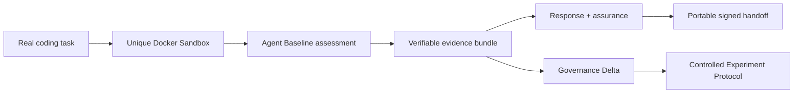

# Agent Baseline Evidence Lab

[](https://github.com/riccardomenegazzo/agent-baseline-evidence-lab/actions/workflows/ci.yml)
[](https://github.com/riccardomenegazzo/agent-baseline-evidence-lab/releases/latest)
[](pyproject.toml)
[](LICENSE)

**A customer-ready reference PoC for turning AI-agent governance requirements into reproducible, independently verifiable evidence.**

> Community project. Not an official Docker, Snyk, Keycard, or Agent Baseline project. It does **not** issue certifications or claim official conformance.

AI-agent security guidance is easy to describe and much harder to prove. This project asks a narrower question:

> **For this agent, in this environment, during this run: what can we actually prove?**

It uses the **Agent Baseline v1.0-draft** as a control vocabulary and **Docker Sandboxes** as the primary execution surface. The lab maps all 35 draft controls to declared state, runtime observations, bounded adversarial scenarios, MCP policy evidence, validation results, response evidence and explicit gaps.

There is deliberately **no marketing security score**.

---

## Why this exists

An enterprise adopting coding agents needs stronger answers than:

- “the agent runs in a sandbox”;
- “we have an MCP policy”;
- “audit logs exist”;
- “the stop command succeeded”;
- “the artifact is signed”.

Those statements describe product presence or intent. They do not necessarily prove isolation, enforcement, attribution, containment, completeness or signer identity.

Agent Baseline Evidence Lab converts those claims into a repeatable evidence lifecycle:



The design goal is simple: **prove what can be proven, and make everything else visible.**

---

## What the project demonstrates

A customer PoC can use this repository to:

1. **Run a real coding task** inside a uniquely identified Docker Sandbox.
2. **Observe selected boundaries** through Docker `sbx` inventory, filesystem canaries and network-policy decisions.
3. **Assess 35 draft Agent Baseline controls** without converting missing evidence into `PASS`.
4. **Analyze MCP governance posture** through Cedar-policy checks and optional Docker AI Governance audit metadata.
5. **Validate the agent-modified workspace**, not a separate static fixture.
6. **Preserve evidence integrity** with per-file SHA-256 manifests and a hash-chained normalized trace.
7. **Produce run attestations** and optionally authenticate them with Ed25519 signatures.
8. **Exercise response semantics** with a disposable sandbox-scoped credential binding and verified postconditions.
9. **Create private-key-free customer handoffs** that can be verified offline.
10. **Compare two verified runs** control-by-control without inventing a security score.
11. **Fail closed on causal interpretation** when a before/after pair is not sufficiently controlled.

### Evidence statuses

Every Agent Baseline control is one of:

`PASS` · `FAIL` · `PARTIAL` · `MANUAL` · `N/A` · `ERROR`

A skipped live probe is never counted as a pass.

### Evidence classes

The project separates:

| Class | Meaning |
|---|---|
| **Declared** | configuration and design intent |
| **Observed** | runtime state, policy decisions and postconditions actually collected |
| **Linked** | artifacts correlated by stable identifiers or cryptographic digests |
| **Externally anchored** | evidence authenticated against material outside the artifact being verified |

---

## 60-second safe tour

Clone the repository and run the non-mutating path:

```bash
git clone https://github.com/riccardomenegazzo/agent-baseline-evidence-lab.git
cd agent-baseline-evidence-lab
make install
make golden-demo-dry-run
```

Dry-run mode is intentionally fail-closed. It must not claim live containment, credential revocation, runtime enforcement or audit evidence that was never observed. CI tests that contract.

For the non-technical project summary, start with [`docs/EXECUTIVE_OVERVIEW.md`](docs/EXECUTIVE_OVERVIEW.md).

For the concise walkthrough, use [`docs/DEMO_GUIDE.md`](docs/DEMO_GUIDE.md).

---

## Live customer flow

A live run requires a suitable Docker environment and the relevant Docker Sandboxes authentication/configuration.

Before a customer-facing run, synchronize and verify the upstream draft baseline and establish the local signing key:

```bash
make baseline-sync
make signing-keygen
make baseline-lock-verify
make baseline-lock-sign
make baseline-lock-verify-signature
```

Then run the complete lifecycle:

```bash
make golden-demo
```

The live flow is evidence-first:

```text
readiness
   ↓
real coding task in a unique Docker Sandbox
   ↓
Agent Baseline assessment
   ├─ live sandbox boundary probes
   ├─ bounded adversarial scenarios
   ├─ artifact validation
   ├─ MCP policy evidence
   └─ optional Docker AI Governance evidence
   ↓
immutable evidence bundle
   ↓
disposable response exercise
   ↓
attestation + assurance
   ↓
portable customer evidence pack
```

The response path uses the **actual sandbox identity from the run**. It does not substitute a fixed demo name.

---

## Optional Docker MCP / AI Governance path

Register Docker's public DHI MCP endpoint:

```bash
make mcp-register-dhi
```

Observe the registration and OAuth metadata without persisting token material:

```bash
make mcp-inventory-dhi
make mcp-oauth-status
```

With a live sandbox, probe whether direct network egress could bypass the intended host-side MCP path:

```bash
make mcp-bypass-dhi SANDBOX=<sandbox-name>
```

Run the MCP-focused live path:

```bash
make live-demo-mcp
```

The repository treats static policy analysis as **policy evidence**, not proof of runtime enforcement. Optional Docker AI Governance audit records are promoted to observed activity only when the relevant finalized events are actually available.

---

## Independent verification

After an assessment:

```bash
make verify
make assurance-latest
```

`abl verify` checks that:

1. every manifested evidence file still matches its SHA-256 digest;
2. each normalized trace event links to the previous event hash;
3. the final trace hash and event count match the anchors in the assessment.

The assurance suite adds integrity/authenticity regression checks, signature verification, drift signals and response/incident evidence when available.

Its semantics are intentionally separate from the control assessment:

- `PASS` — executed verification succeeded;
- `FAIL` — a blocking integrity/authenticity check failed;
- `FINDING` — a non-blocking risk signal requires review;
- `NOT_RUN` — optional evidence was unavailable.

A behavioral change is therefore not mislabeled as a framework failure.

---

## Before / after governance evidence

### Governance Delta — what changed?

Given two verified evidence bundles:

```bash
make governance-delta \
  BEFORE=evidence/abl-<before> \
  AFTER=evidence/abl-<after>

make governance-delta-verify \
  BEFORE=evidence/abl-<before> \
  AFTER=evidence/abl-<after>
```

The delta classifies control transitions such as control improvement/regression, evidence gain/loss, evaluator recovery/error, scope change and unchanged controls.

It does **not** compute a security score.

### Controlled Experiment Protocol — can we discuss causality?

A status change alone is not evidence that a governance treatment caused the change.

```bash
make experiment-protocol \
  BEFORE=evidence/abl-<before> \
  AFTER=evidence/abl-<after>
```

The protocol checks measured invariants including baseline version, agent identity, task identity/digest, initial workspace digest, agent runtime and Docker Sandbox runtime fingerprint, while separately fingerprinting the declared governance treatment.

It returns:

- `ELIGIBLE` — required measured invariants match and the treatment differs;
- `NOT_ELIGIBLE` — a required invariant differs, or no treatment change occurred;
- `INSUFFICIENT_EVIDENCE` — a required invariant cannot be established.

`ELIGIBLE` is not proof of causality; it is only the prerequisite boundary for a bounded causal interpretation.

See [`docs/CONTROLLED_EXPERIMENT.md`](docs/CONTROLLED_EXPERIMENT.md).

---

## Portable customer handoff

Create a portable single-run evidence package:

```bash
make customer-pack
make customer-pack-verify
```

For a before/after handoff:

```bash
make comparison-pack \
  BEFORE=evidence/abl-<before> \
  AFTER=evidence/abl-<after>

make comparison-pack-verify
```

The comparison pack contains independently verifiable before/after customer evidence, the governance delta, signature material and the public verification key. Local private signing keys are explicitly excluded.

The pack also minimizes host-local project/home path prefixes before export.

---

## What gets produced

```text
agent-runs/
└── agent-<timestamp>-<id>/
    ├── session.json
    ├── workspace-before.json
    ├── workspace-after.json
    ├── workspace-changes.json
    ├── docker-observations.json
    └── manifest.sha256.json

evidence/
└── abl-<timestamp>/
    ├── inputs/
    ├── controls/
    ├── observations/
    ├── trace/events.ndjson
    ├── assessment.json
    └── manifest.sha256.json

reports/
├── abl-<timestamp>.json
├── abl-<timestamp>.html
├── abl-<timestamp>.attestation.json
├── assurance-summary.json
├── governance-delta.json
├── governance-delta.html
├── controlled-experiment.json
├── controlled-experiment.html
├── customer-evidence-pack.zip
└── governance-comparison-pack.zip
```

Raw prompts and raw agent output are not persisted by default. The live-run capsule stores digests and bounded metadata unless explicit output capture is requested.

---

## Claims the project deliberately refuses

The lab does **not** assume that:

- `Docker Sandbox installed → isolation control solved`;
- `MCP Gateway present → authorization solved`;
- `policy file exists → enforcement proven`;
- `audit logs exist → end-to-end attribution proven`;
- `sbx stop returned 0 → containment proven`;
- `credential binding removed → upstream provider token revoked`;
- `signature verifies → signer identity is trusted`;
- `hash chain verifies → source telemetry was complete`;
- `before/after improved → governance treatment caused the improvement`.

These distinctions are documented in [`docs/CLAIMS_BOUNDARY.md`](docs/CLAIMS_BOUNDARY.md).

---

## Download a release

The recommended distribution channel is [GitHub Releases](https://github.com/riccardomenegazzo/agent-baseline-evidence-lab/releases/latest).

Each automated release publishes:

- an installable Python wheel;
- a source distribution;
- `SHA256SUMS`;
- `release-manifest.json` binding artifact digests to the source commit.

See [`DOWNLOAD.md`](DOWNLOAD.md) for installation and verification instructions.

---

## Documentation map

Start here depending on the audience:

- **Executive / recruiting / leadership:** [`docs/EXECUTIVE_OVERVIEW.md`](docs/EXECUTIVE_OVERVIEW.md)
- **Customer PoC:** [`docs/CUSTOMER_POC.md`](docs/CUSTOMER_POC.md)
- **Demo walkthrough:** [`docs/DEMO_GUIDE.md`](docs/DEMO_GUIDE.md)
- **Architecture:** [`docs/ARCHITECTURE.md`](docs/ARCHITECTURE.md)
- **Control coverage:** [`docs/CONTROL_COVERAGE.md`](docs/CONTROL_COVERAGE.md)
- **Evidence model:** [`docs/EVIDENCE_MODEL.md`](docs/EVIDENCE_MODEL.md)
- **Docker evidence sources:** [`docs/DOCKER_EVIDENCE_SOURCES.md`](docs/DOCKER_EVIDENCE_SOURCES.md)
- **Governance Delta:** [`docs/GOVERNANCE_DELTA.md`](docs/GOVERNANCE_DELTA.md)
- **Controlled Experiment Protocol:** [`docs/CONTROLLED_EXPERIMENT.md`](docs/CONTROLLED_EXPERIMENT.md)
- **Response evidence:** [`docs/RESPONSE_DRILL.md`](docs/RESPONSE_DRILL.md)
- **Claims boundary:** [`docs/CLAIMS_BOUNDARY.md`](docs/CLAIMS_BOUNDARY.md)
- **Roadmap:** [`docs/ROADMAP.md`](docs/ROADMAP.md)

---

## Development and CI

```bash
make install
make test
make lint
make golden-demo-dry-run
```

CI exercises the package build and CLI entrypoints, framework tests, sample application tests, offline assessment, evidence verification, adversarial verifier regression, response fail-closed semantics, run-attestation binding, Ed25519 signing, Governance Delta, offline comparison handoff, privacy boundaries, assurance and the complete dry-run Golden Flow.

The release workflow only publishes a new version after the main CI succeeds, builds wheel + source distribution, generates SHA-256 release metadata and smoke-tests the wheel in a clean virtual environment.

---

## Project status

The repository is an **implementation and assurance lab**, not a finished enterprise governance product.

The current vertical slice includes:

- all 35 Agent Baseline draft controls with explicit evidence semantics;
- Docker Sandbox runtime probes and bounded adversarial scenarios;
- MCP policy analysis and optional Docker AI Governance audit ingestion;
- privacy-minimized evidence and trace generation;
- run attestations and Ed25519 signing;
- response, quarantine and incident evidence;
- portable customer evidence packs;
- Governance Delta before/after comparison;
- Controlled Experiment Protocol;
- automated downloadable releases.

Remaining work is intentionally focused on stronger **live** evidence where the surrounding Docker/provider environment exposes trustworthy postconditions — not on manufacturing green results for unavailable signals.

See [`docs/ROADMAP.md`](docs/ROADMAP.md).

---

## License

Apache-2.0 for this repository's code. Agent Baseline materials remain under their upstream licenses and ownership; authoritative control requirement prose is not silently vendored here.
