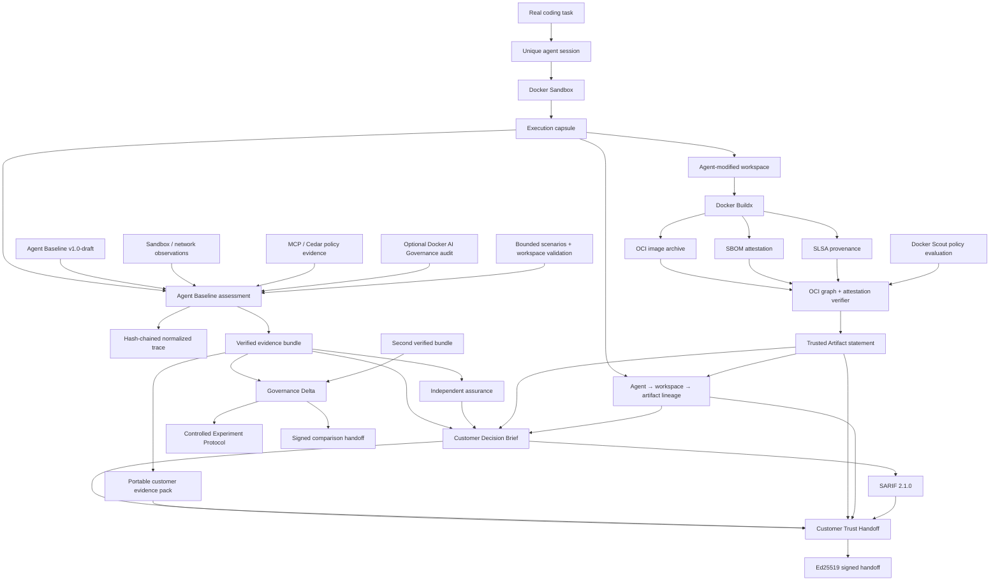

# Architecture

Agent Baseline Evidence Lab is an **evidence and trust-lifecycle engine** for governed AI coding-agent workflows. It is not a compliance scanner, not a product-presence detector, and not a Docker certification tool.

The architecture is split into four trust planes:

1. **Execution + assessment** — run the agent and collect run-scoped governance evidence.
2. **Artifact trust** — build and verify the resulting OCI artifact, attestations and agent-to-artifact lineage.
3. **Assurance + customer handoff** — independently verify, decide, package and authenticate shareable evidence.
4. **Comparative evidence** — compare verified runs while keeping causal interpretation separate from status change.

---

## End-to-end architecture



The preferred manager/customer entrypoint is:

```bash
abl-trust --scout-mode observe
```

The core design rule is: **no downstream trust claim may be stronger than the evidence that feeds it.**

---

# Plane 1 — execution and assessment

## Control catalogue

The project tracks Agent Baseline control IDs and implementation mappings while keeping authoritative requirement prose upstream. Baseline synchronization creates a lock containing source digest, control identifiers, version/status and drift metadata. A live customer trust flow requires that lock to be verified and signed before agent execution.

## Live execution capsule

A real task is executed separately from the assessment engine:

```text
task digest
   ↓
disposable workspace copy
   ↓
unique Docker Sandbox
   ↓
coding agent
   ↓
workspace before/after digests
Docker observations
agent execution metadata
   ↓
agent-run manifest
```

Raw prompt and raw agent output are not persisted by default. The capsule records bounded metadata and cryptographic digests unless explicit output capture is requested.

The execution capsule and assessment bundle are distinct trust domains: the assessment verifies the capsule manifest before importing it.

## Evaluator layer

Evaluators consume declared and observed evidence from sources such as:

- Docker `sbx` inventory and policy commands;
- host-canary separation checks;
- network policy decision checks;
- Docker MCP registration inventory;
- Cedar policy static analysis;
- optional Docker AI Governance audit JSONL;
- workspace validation hooks;
- bounded adversarial scenarios;
- response and incident evidence where applicable.

Each evaluator returns one of:

`PASS` · `FAIL` · `PARTIAL` · `MANUAL` · `N/A` · `ERROR`

Unavailable evidence never becomes a positive result.

## Evidence bundle

Each assessment produces:

- per-control evidence;
- normalized hash-chained trace;
- `assessment.json`;
- `manifest.sha256.json`;
- JSON/HTML reports;
- an in-toto-style run attestation.

`abl verify` recomputes manifest, trace chain, trace head and event-count relationships.

---

# Plane 2 — artifact trust

The artifact trust plane answers a different question from the governance assessment:

> **Did the agent-modified workspace produce the exact container artifact we think it produced, and what supply-chain evidence can we verify about it?**

## Buildx output

The trusted-artifact path builds the agent-modified workspace with Docker Buildx and requests:

- an OCI image archive;
- SBOM attestation;
- provenance attestation;
- BuildKit metadata.

The OCI archive is local execution material. It is intentionally excluded from the default customer handoff; its digest and verification findings remain represented in portable trust evidence.

## OCI graph verification

The verifier does not equate “archive exists” with “artifact trusted”. It traverses and verifies the OCI graph, including relevant descriptor digests and sizes, image manifest/config relationships and attestation manifests.

Where present, SBOM and provenance statements are checked for valid subject binding to the runnable image subject rather than accepted merely because an attestation media type exists.

## Docker Scout modes

The flow supports three explicit policy modes:

- `off` — Scout is not part of the artifact disposition;
- `observe` — collect Scout policy evidence without making it a hard release gate;
- `gate` — require the configured Scout evaluation to pass before `EVIDENCE_READY` can be returned.

A Scout pass is a bounded policy result for the evaluated image and policy set. It is not Docker certification and does not prove that the artifact is vulnerability-free.

## Trusted Artifact statement

The machine-readable trusted-artifact statement records the observed artifact digest, OCI verification results, attestation findings, Scout result and claims boundary. A portable copy is generated before customer export so local filesystem prefixes are not leaked.

## Agent-to-artifact lineage

The lineage statement binds:

```text
agent session
  ↓
verified post-agent workspace digest
  ↓
trusted OCI artifact digest
```

Lineage creation fails if the workspace changed after the agent session or if the OCI archive changed after the trusted-artifact statement. The lineage statement can then be signed and independently verified.

This proves a cryptographic relationship between recorded execution state and artifact state. It does not prove source-code correctness or runtime safety of every workload behavior.

---

# Plane 3 — assurance, decision and customer handoff

## Internal integrity versus external trust

The assessment bundle uses SHA-256 manifests, a trace hash chain and run anchors. These are **internal integrity mechanisms**, not immutable external trust anchors.

Selected artifacts can be authenticated with Ed25519. A valid signature establishes possession of the corresponding key for the exact subject; external human/organizational identity still requires independent trust distribution.

## Post-run assurance

The assurance suite independently checks evidence integrity/authenticity contracts and reports:

- `PASS` — verification executed and succeeded;
- `FAIL` — blocking integrity/authenticity failure;
- `FINDING` — non-blocking risk signal;
- `NOT_RUN` — optional evidence unavailable.

This layer remains separate from control statuses.

## Customer Decision Brief

The decision layer composes assessment, assurance and artifact trust evidence into one run-specific disposition:

- `BLOCKED` — a required trust condition failed;
- `CONDITIONAL` — useful evidence exists but the configured decision boundary is not fully satisfied;
- `EVIDENCE_READY` — the configured evidence requirements for this PoC run are satisfied;
- `DRY_RUN` — orchestration was exercised without live trust claims.

`EVIDENCE_READY` is not production authorization, compliance certification or official Docker conformance.

## SARIF integration

Governance and artifact findings can be exported as SARIF 2.1.0 so the PoC can fit existing security-review workflows instead of requiring a custom dashboard.

## Customer Trust Handoff

The final handoff is a deterministic, manifest-driven ZIP that combines portable evidence needed to review the run, including as applicable:

- golden customer evidence pack;
- public verification key;
- trusted-artifact statement + signature;
- agent-artifact lineage + signature;
- decision JSON/HTML + signature;
- SARIF;
- sanitized BuildKit/Scout evidence;
- visual customer trust-flow summary.

The handoff verifier checks:

- ZIP path safety and duplicate/unmanifested members;
- SHA-256 and size of every manifested member;
- private-key exclusion;
- OCI binary archive exclusion;
- nested customer evidence-pack verification;
- nested customer-pack signature;
- lineage signature when present.

The final handoff itself is signed separately.

---

# Plane 4 — comparative evidence

## Governance Delta

Governance Delta operates only on independently verified assessment bundles with the same Agent Baseline version/control set. It reports control and evidence transitions without a synthetic score.

## Controlled Experiment Protocol

The experiment layer checks whether required measured invariants match while the declared governance treatment differs. Outcomes are:

- `ELIGIBLE`;
- `NOT_ELIGIBLE`;
- `INSUFFICIENT_EVIDENCE`.

`ELIGIBLE` is only a prerequisite boundary for bounded causal discussion, not causal proof.

## Comparison handoff

The comparison pack combines independently verifiable before/after customer evidence, Governance Delta, signatures and public trust material while excluding private keys.

---

# Release supply-chain trust

The project applies the same distinction to its own distribution artifacts.

The release workflow produces wheel, source distribution, `SHA256SUMS` and `release-manifest.json`. Before publication it creates GitHub Artifact Attestations with SLSA provenance and verifies them with `gh attestation verify`.

This adds repository/workflow-backed provenance to release artifacts; checksum verification and provenance verification remain distinct operations. See [`RELEASE_PROVENANCE.md`](RELEASE_PROVENANCE.md).

---

# Core design rules

1. **Never infer `PASS` from product presence.**
2. **Never infer artifact trust from artifact existence.**
3. **Missing evidence remains visible.**
4. **Declared state and observed state remain separate.**
5. **Assessment trust and artifact trust are separate planes.**
6. **SBOM/provenance must be subject-bound, not presence-checked.**
7. **A policy pass is scoped to the evaluated policy set.**
8. **Evidence is run-scoped and independently verifiable.**
9. **Privacy is applied before customer export.**
10. **A signature is not an identity claim.**
11. **A hash chain is not a source-completeness proof.**
12. **Artifact lineage is not source-code correctness proof.**
13. **A before/after change is not a causal conclusion.**
14. **The draft baseline remains upstream-authoritative.**

---

# Docker boundary

Docker Sandboxes is the primary agent execution surface. Docker Buildx and OCI attestations form the artifact-production path. Docker Scout is an optional policy evidence/gating layer. Docker MCP / AI Governance evidence remains environment-dependent and is treated separately from the community path.

The architecture intentionally avoids pretending that local policy files, local image metadata or product availability are equivalent to centrally observed enforcement or organizational certification.
