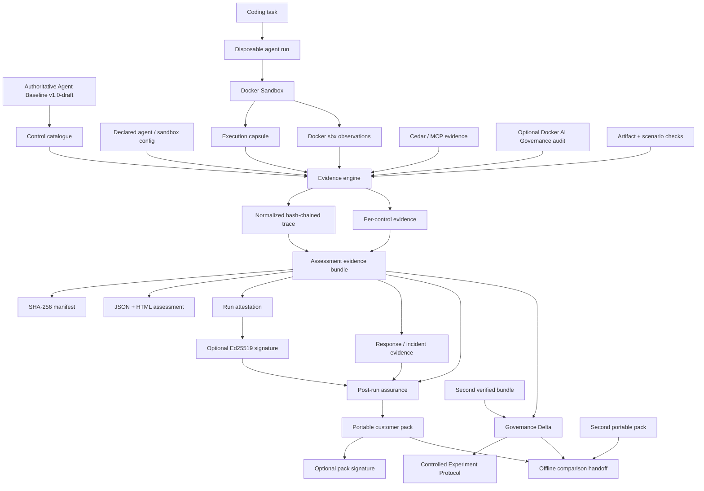

# Architecture

Agent Baseline Evidence Lab is an **evidence engine**, not a compliance scanner and not a product-presence detector.

The architecture is intentionally split into three planes:

1. **Execution + assessment** — collect run-scoped implementation evidence;
2. **Assurance + handoff** — verify, authenticate and package that evidence;
3. **Before/after analysis** — compare verified runs while keeping causal interpretation separate.

---

## End-to-end architecture



---

## Plane 1 — execution and assessment

### 1. Control catalogue

The project tracks Agent Baseline control IDs and implementation mappings while keeping authoritative requirement prose upstream. Baseline synchronization creates a source lock with source digest, control identifiers, version/status and drift information.

The baseline lock can be independently verified and signed before a live customer run.

### 2. Live execution capsule

A real agent task is executed separately from the assessment engine:

```text
task file
   │  SHA-256 + size persisted by default
   ▼
disposable workspace copy
   │
   ▼
unique Docker Sandbox
   │
   ├─ coding agent
   ├─ network constraints
   └─ optional static MCP registrations
   │
   ▼
workspace before/after digests
Docker observations
agent execution metadata
   │
   ▼
agent-run manifest
```

Raw prompt and raw agent output are not persisted by default. The capsule records bounded metadata and digests unless explicit output capture is requested.

The execution capsule and assessment bundle are separate trust domains: the assessment verifies the imported capsule manifest before relying on it.

### 3. Evaluator layer

Evaluators consume declared state and observed evidence from sources such as:

- Docker `sbx` inventory and policy commands;
- safe host-canary separation checks;
- network policy decision checks;
- Docker MCP registration inventory;
- Cedar policy static analysis;
- optional Docker AI Governance audit JSONL;
- artifact validation commands;
- bounded adversarial scenarios;
- response and correlation artifacts where applicable.

Each evaluator returns one of:

`PASS` · `FAIL` · `PARTIAL` · `MANUAL` · `N/A` · `ERROR`

A missing tool, unavailable telemetry source or evaluator exception is never promoted to positive evidence.

### 4. Normalized trace

The lab writes one NDJSON event per normalized action. Each event contains a `prev_event_hash`; the current `event_hash` is SHA-256 over canonical JSON for the event content.

External Docker audit events preserve available source identifiers such as audit event/session IDs rather than being rewritten to look native to the lab.

### 5. Evidence store

Each assessment receives a unique run ID and produces:

- per-control evidence;
- run observations;
- normalized trace;
- `assessment.json`;
- SHA-256 file manifest;
- JSON / HTML reports;
- in-toto-style run attestation.

Privacy-sensitive local path prefixes and selected identity metadata are minimized before persistence/export where the relevant path supports it.

---

## Plane 2 — assurance and customer handoff

### Internal integrity anchors

The assessment bundle uses:

- per-file SHA-256 manifest;
- trace hash chain;
- final trace head + event count anchored in `assessment.json`.

`abl verify` recomputes those relationships.

These mechanisms provide **tamper evidence**, not tamper-proof storage.

### External anchors and signatures

The verifier can accept expected manifest/trace-head digests from outside the bundle.

Run attestations, baseline locks, Governance Delta statements, experiment statements and customer packs can be authenticated with Ed25519 signatures.

A valid signature means the verifier confirmed possession of the corresponding private key for the exact signed subject. It does **not** establish human or organizational identity unless the public key is trusted through an external channel.

### Adversarial verifier matrix

CI preserves several deliberately uncomfortable trust-boundary results:

- single-file alteration must fail internal verification;
- trace truncation must fail;
- a coordinated producer-side rewrite can remain internally self-consistent;
- an independently retained external digest detects that coordinated rewrite;
- no exported artifact can prove a source event existed if it never entered the evidence pipeline.

This keeps **integrity**, **external anchoring** and **source completeness** separate.

### Response and incident layer

Response mutation is separate from normal assessment execution.

The live customer flow can:

- stop the exact sandbox associated with the run;
- verify the stopped postcondition;
- create/remove a disposable sandbox-scoped credential binding;
- verify the local binding is absent;
- link response evidence back to the immutable assessment bundle;
- register quarantine evidence;
- build a digest-only incident bundle.

Local credential-binding removal is not described as upstream provider token revocation.

### Portable customer pack

A customer pack is a deterministic transport artifact containing shareable assessment evidence and public trust material.

The default pack excludes:

- private Ed25519 signing keys;
- raw local agent-run capsules;
- out-of-root incident artifacts;
- known local project/home path prefixes.

The pack verifier protects against path traversal, symlinks, duplicate members, unmanifested content and evidence tampering.

A signed pack authenticates the package relative to the supplied public key; it is still not an external organizational identity proof.

---

## Plane 3 — before/after evidence

### Governance Delta

Governance Delta operates only on independently verified assessment bundles with the same Agent Baseline version/control set.

It reports control transitions such as:

- `control-improvement`;
- `control-regression`;
- `evidence-gain`;
- `evidence-loss`;
- `evaluator-recovery`;
- `evaluator-error`;
- `scope-change`;
- `unchanged`.

It deliberately does not compute a synthetic security score.

The JSON delta is recomputable from the source bundles and can be signed.

### Controlled Experiment Protocol

The experiment layer answers a different question:

> Are the two runs sufficiently controlled, based on measured evidence, to discuss the governance treatment as a possible causal factor?

It evaluates required measured invariants such as:

- baseline version;
- agent identity;
- task ID;
- task SHA-256;
- initial workspace SHA-256;
- agent runtime;
- Docker Sandbox runtime fingerprint.

The declared governance treatment is fingerprinted separately from those invariants.

Results:

- `ELIGIBLE` — measured invariants match and treatment differs;
- `NOT_ELIGIBLE` — an invariant differs or treatment is unchanged;
- `INSUFFICIENT_EVIDENCE` — a required invariant cannot be established.

`ELIGIBLE` is only an eligibility boundary. It does not prove causality or eliminate unmeasured confounders.

### Comparison handoff

The offline comparison pack combines:

- before customer evidence pack;
- after customer evidence pack;
- Governance Delta JSON + HTML;
- delta signature;
- public verification key;
- comparison manifest;
- outer pack signature.

The pack requires distinct run IDs and remains private-key-free.

---

## Core design rules

1. **Never infer `PASS` from product presence.**
2. **No hidden green defaults.** Missing evidence remains visible.
3. **Safe probes by default.** Prefer bounded decision checks and disposable canaries.
4. **Declared state and observed state remain separate.**
5. **Evidence is run-scoped and independently verifiable.**
6. **External telemetry is normalized, not silently trusted.**
7. **Privacy is applied before persistence/export where supported.**
8. **A signature is not an identity claim.**
9. **A hash chain is not a source-completeness proof.**
10. **A before/after change is not a causal conclusion.**
11. **The draft baseline remains upstream-authoritative.**

---

## Docker boundary

The evidence engine executes on the host. Docker Sandboxes is the primary target execution boundary. The engine invokes documented Docker surfaces and stores bounded results as evidence.

Docker AI Governance audit ingestion is optional and treated as a separate evidence source. The community path does not require licensed AI Governance evidence in order to remain useful.

The architecture intentionally avoids pretending that local policy/configuration analysis is the same as centrally observed enforcement.
